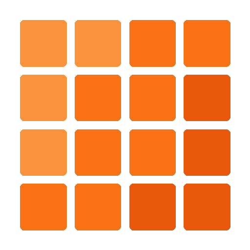

# Mosaic

<p align="center">
  
</p>

<p align="center">
  <a href="https://github.com/HectorIFC/mosaic/actions/workflows/ci.yml"></a>
  <a href="https://jitpack.io/#HectorIFC/mosaic"></a>
  <a href="https://github.com/HectorIFC/mosaic/blob/main/LICENSE"></a>
  
  
  
</p>

> **Lookup-based token embeddings for the JVM, in pure Kotlin.**
>
> *Tessera is the piece. Mosaic is the whole.*

**🌐 Site:** [hectorifc.github.io/mosaic](https://hectorifc.github.io/mosaic/)

## Status

✅ **v0.0.1 ready** — all 6 phases complete.

See [ARCHITECTURE.md](./ARCHITECTURE.md) for design details.

## About

Mosaic is a **Kotlin library** that provides a trainable `EmbeddingTable` — a `[vocabSize × embeddingDim]` matrix mapping token IDs to dense `Float` vectors. Built as a sister project to [Tessera](https://github.com/HectorIFC/tessera) (BPE tokenizer), completing the `text → tokens → vectors` pipeline in pure Kotlin.

**What Mosaic is:**

- A lookup table modeled on PyTorch's `nn.Embedding`
- Efficient flat 1D `FloatArray` storage (cache-friendly, ~1 % overhead)
- Essential vector operations (cosine similarity, top-K nearest)
- 6 pluggable initializers (`uniformDefault`, `uniform`, `xavier`, `he`, `zeros`, `constant`)
- Compact binary persistence with SHA-256 checksum
- Native Tessera integration via `TesseraEmbeddings`

**What Mosaic is NOT:**

- It does **not** train embeddings (no Word2Vec, no backprop, no SGD)
- No dense matrix-by-matrix operations
- No GPU acceleration
- No quantization
- Text only (no image/audio embeddings)

The intent is to be a **solid Lego block**: other projects (yours or future) that want to actually train embeddings can use Mosaic as the storage layer and update weights via the public API.

### Principles

- **Library, not application** — meant to be consumed by other Kotlin projects (but ships with a CLI module for debug)
- **Pure Kotlin** — no ML libraries, no math libraries (unless proven necessary for performance)
- **`FloatArray` everywhere** — no `Double`, no boxing, no `List<Float>`
- **Flat 1D storage** — cache locality matters
- **Minimal public API** — only what's necessary, all marked `public` explicitly via `explicitApi()`

## Installation

### Gradle (Kotlin DSL) — via JitPack

```kotlin
// settings.gradle.kts
dependencyResolutionManagement {
    repositories {
        mavenCentral()
        maven { url = uri("https://jitpack.io") }
    }
}

// build.gradle.kts
dependencies {
    implementation("com.github.HectorIFC:mosaic:mosaic-core-v0.0.1")
    // Tessera comes as a transitive dependency — no need to declare it explicitly
}
```

### Gradle (Kotlin DSL) — via GitHub Packages

```kotlin
// settings.gradle.kts
dependencyResolutionManagement {
    repositories {
        mavenCentral()
        maven {
            url = uri("https://maven.pkg.github.com/HectorIFC/mosaic")
            credentials {
                username = System.getenv("GITHUB_ACTOR")
                password = System.getenv("GITHUB_TOKEN")
            }
        }
    }
}

// build.gradle.kts
dependencies {
    implementation("dev.mosaic:mosaic-core:0.0.1")
}
```

## Quick start

### Full pipeline with Tessera

```kotlin
import dev.mosaic.EmbeddingTable
import dev.mosaic.TesseraEmbeddings
import dev.mosaic.Initializer
import dev.tessera.BpeTokenizer

fun main() {
    // 1. Load a previously-trained Tessera tokenizer
    val tokenizer = BpeTokenizer.load("tessera.json")

    // 2. Create an embedding table with a matching vocab size
    val embeddings = EmbeddingTable.create(
        vocabSize = tokenizer.vocabSize,
        embeddingDim = 128,
        initializer = Initializer.uniformDefault(seed = 42L),
    )

    // 3. Wire them into a pipeline
    val pipeline = TesseraEmbeddings(tokenizer, embeddings)
    val vectors = pipeline.encode("Hello, mosaic!")

    println("Got ${vectors.size} vectors of dim ${vectors[0].size}")

    // 4. Persist for later
    embeddings.save("mosaic.bin")
}
```

### Direct EmbeddingTable use

```kotlin
val table = EmbeddingTable.create(vocabSize = 1000, embeddingDim = 64)

// Lookup
val v = table.get(id = 42)

// Write (for external training loops)
val newVec = FloatArray(64) { 0.1f * it }
table.set(id = 42, vector = newVec)

// Similarity
val similar = table.mostSimilar(id = 42, topK = 5)
similar.forEach { (id, score) -> println("Token $id → score $score") }
```

More examples in the [`mosaic-samples`](./mosaic-samples/) module.

## Project structure

This is a **Gradle multi-module** project with 3 modules:

```
mosaic/
├── mosaic-core/       ← the library (the published JAR)
├── mosaic-cli/        ← CLI application built on top of the lib
└── mosaic-samples/    ← runnable usage examples
```

- **`mosaic-core`** — the consumable JAR. Minimal public API. Published to JitPack and GitHub Packages.
- **`mosaic-cli`** — runnable application (`./gradlew :mosaic-cli:run`) with commands `create`, `inspect`, `stats`, `similar`, `encode`. Useful for interactive debugging.
- **`mosaic-samples`** — small Kotlin programs with `main()` demonstrating usage patterns.

## Running locally

```bash
# Build everything
./gradlew build

# Run tests
./gradlew test

# Full quality pipeline
./gradlew test koverVerify ktlintCheck detekt

# Install the library into Maven Local for testing in other projects
./gradlew publishToMavenLocal

# Run the CLI
./gradlew :mosaic-cli:run --args="--help"
./gradlew :mosaic-cli:run --args="create --vocab-size 1000 --dim 64 --output embeddings.bin"
./gradlew :mosaic-cli:run --args="inspect --input embeddings.bin"

# Run a sample
./gradlew :mosaic-samples:run -PmainClass=dev.mosaic.samples.QuickStartSampleKt
```

## Architecture

In a nutshell:

1. **Storage** — the matrix is held in a single contiguous `FloatArray` of size `vocabSize × embeddingDim`. Row `i` lives at offset `i × embeddingDim`.
2. **Lookup** — `get(id)` returns a **copy** of the slice. Mutating the result never touches the table.
3. **Vector ops** — all live in stateless `VectorOps`. Sums are accumulated in `Double` and narrowed back to `Float` on return, avoiding precision drift.
4. **`mostSimilar`** — implemented with a fixed-size min-heap for `O(N log K)`.
5. **Persistence** — compact binary `.bin` (16-byte header + raw float32 LE) + JSON `.meta.json` sidecar. SHA-256 checksum verifies integrity.
6. **Tessera integration** — `TesseraEmbeddings` combines tokenizer and table into one class; the vocab-size match is checked at construction.

See [ARCHITECTURE.md](./ARCHITECTURE.md) for the deeper rationale.

## Benchmarks

On Apple M1 / JVM 21, at `dim = 128`:

| vocabSize | `mostSimilar(topK=10)` | save     | load     |
|----------:|-----------------------:|---------:|---------:|
| 10 000    | **3.09 ms**            | 11.10 ms | 4.69 ms  |
| 50 000    | 11.67 ms               | 50.48 ms | 22.14 ms |
| 100 000   | 23.16 ms               | 108.06 ms | 80.62 ms |

The acceptance criterion (`< 100 ms at 10 K vocab × 128 dim`) is met with a ~32× margin. Full details in [BENCHMARKS.md](./BENCHMARKS.md).

## Roadmap

- [x] **Phase 0** — Gradle multi-module setup + GitHub infrastructure (workflows, dependabot, PR template, detekt) + Tessera dependency
- [x] **Phase 1** — Core lib (EmbeddingTable, Initializer, VectorOps, mostSimilar)
- [x] **Phase 2** — Binary persistence + TesseraEmbeddings integration
- [x] **Phase 3** — Samples + benchmarks + ≥ 80 % coverage
- [x] **Phase 4** — CLI (create, inspect, stats, similar, encode)
- [x] **Phase 5** — GitHub Pages live (logo + MP4 animations + orange/black/white palette)
- [x] **Phase 6** — Publication on JitPack + polish (v0.0.1)

## Related projects

- **[Tessera](https://github.com/HectorIFC/tessera)** — byte-level BPE tokenizer (Mosaic depends on it via JitPack)
- **A future project** — possibly a Word2Vec/Skip-gram trainer that consumes Mosaic as its storage, or a small transformer

## License

MIT — see [LICENSE](./LICENSE).

---

> *"Mosaic" — an artwork composed of many individual pieces (tesserae) arranged to form a complete image.*
>
> *In Tessera, each token is an isolated piece — a chunk of bytes with an ID. In Mosaic, those pieces find their place in a vector space where, together, they begin to form meaning. A token alone is just an index; surrounded by its neighbors, it is part of a larger semantic structure.*
